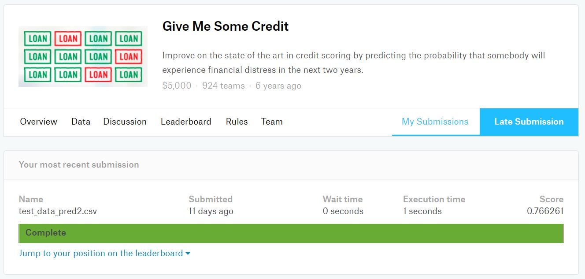
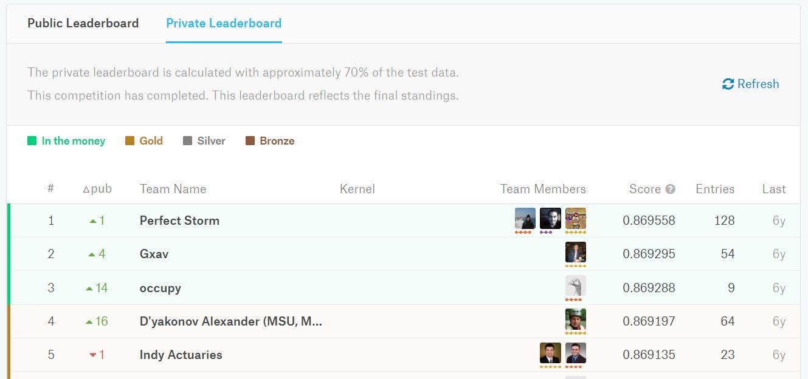
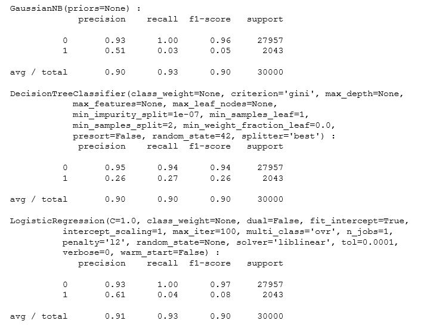

# Kaggle- Give Me Some Credit
Language: Python (scikit-learn, Matplotlib, pandas, NumPy)   
Skills: Machine Learning, Data Exploration, Data Visualization  
Built Supervised Machine Learning models to predicting the probability that somebody will experience 
financial distress in the next two years. Received a score of 0.77 and the winner of the competition had a score of 0.87.   

  

  

  

